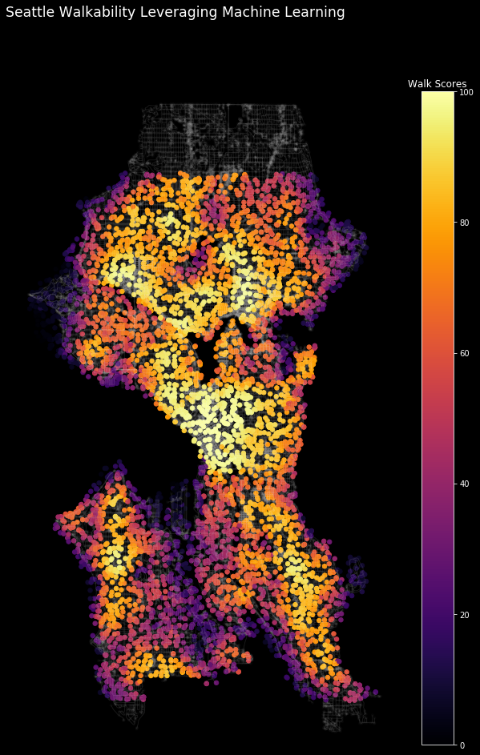

# Reverse Engineering the Walk Score Algorithm
Using Machine Learning to Recreate Walk Score's Methodology: What makes a location "Walkable"?

I've previously used the Walk Score API as a data source for [predicting clustering of electric scooter locations] (https://towardsdatascience.com/a-birds-eye-view-leveraging-machine-learning-to-generate-nests-30dd2136a839). Walk Score is a website that takes an address and computes, using proprietary algorithms and various data streams, a measure of its walkability on a scale from 0–100.
As someone who enjoys walking (and hiking!), I've become curious as to what fuels these proprietary algorithms that generate a walkability score. 

I set out to ask the following questions: 
1) *Can the proprietary Walk Score algorithms be reverse engineered?* 

2) *What features are important in building a walkability score?*

To answer these questions, I built a custom data set by collecting a diverse set of granular Seattle city data and Walk Score API data to train machine learning models to predict a walkability score. I was able to train a model that  achieved a R² of 0.95 on test-set data. R-squared explains to what extent the variance of the feature set explains the variance of the Walk Score. In essence, I was able to reverse engineer the Walk Score methodology and recreate the proprietary algorithms that power their Walk Score. The most important features for a location's walkability are the number of restaurants within 1000 meters, population density within that census tract, number of supermarkets within 1000 meters, and proximity in meters to the nearest commercial zoning.
